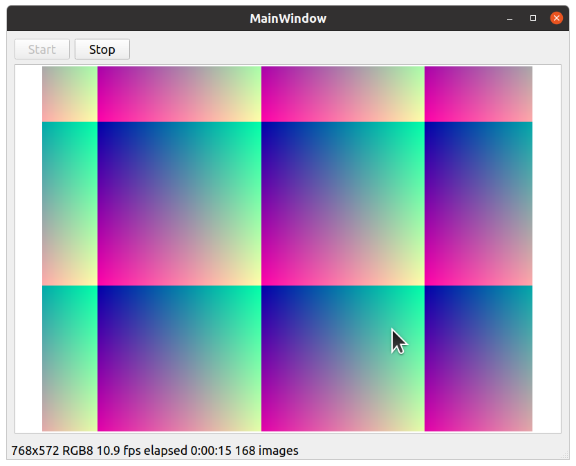

# Proposed enhancements for `harvesters_gui`



## Goal

`harvesters_gui` is excellent for demonstration purposes and should remain as it is.

However it should be possible to use `harvesters_gui` this way:

* Create own user interface using qt designer.
* Reuse the components in `harvesters_gui`
  * The widget which shows the image (previously `canvas.py`, now `qtimageviewer.py`)
  * Property tree view.
  * The bridge between harvestes and QT (`util_harvesters/image_buffer.py`)
  * A mechanism to preconfigure cameras.


## harverstes_gui rewrite

### Install and run

```
pip install -r requirements.txt
pip install -r requirements_development.txt

python main.py
```

Features

* The genicam camera simulation is the default. Camera configuration may be switches here:
```python
    # camera = camera_config.CameraBasler()
    camera = camera_config.CameraSimulation()
```

* The start/stop button works
* Tested on ubuntu and windows
* Mouse wheel: Zoom
* Left mouse drag: Move image
* Left mouse double click: Reset zoom
* Resizeing the window resizes the image
* Widget might be used in the qt designer
```bash
designer main_window.ui
pyuic5 -x main_window.ui -o main_window.py
```
* No dependency anymore to vispy

## Widget: `util_qt/qtimageviewer.py`

Based on https://github.com/marcel-goldschen-ohm/PyQtImageViewer/blob/master/QtImageViewer.py

### Testing standalone

```
python -m util_qt.qtimageviewer
```

Features

* Mouse wheel: Zoom
* Left mouse drag: Move image
* Left mouse double click: Reset zoom
* Resizeing the window resizes the image

This widget is integrated in the current application

## Widget: `util_qt/qharvesterswidget.py`

Based on https://github.com/genicam/harvesters_gui/blob/master/src/harvesters_gui/_private/frontend/canvas.py

### Testing standalone

```
python -m util_qt.qharvesterswidget
```

Features

* Mouse wheel: Zoom
* Left mouse drag: Move image

Not tested with current application.
`qtimageviewer.py` is much simpler and performs excellent. There is no need to continue with `qharvesterswidget.py`.


## `util_harvesters/image_buffer.py`

Features

I tried to encapsulate anything between `harvesters` and `QT`. Most of this code was in `canvas.py`.

Now `qtimageviewer.py` does not contain any `harvesters` code.

And `main.py` is small and sexy.


## `camera_config.py`

`havesters_gui` has these features

* Select a camera in the combobox
* Property editor for that camera.

This is perfect for demonstration purposes.

However in a *real* application, a camera should be preconfigured.

In `camera_config.py`, cameras may be preconfigured.

